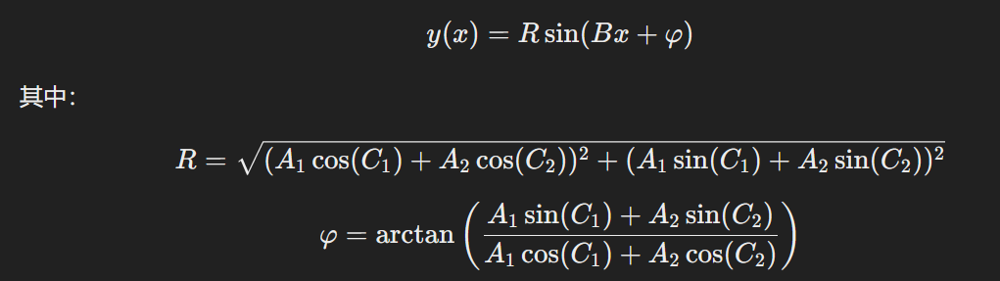
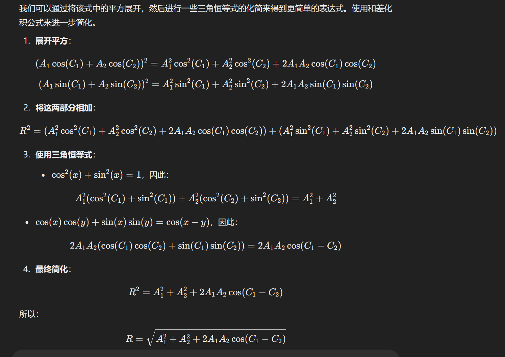

# VM_Scheduler_HW

## Overview

**alibaba**文件夹：对Alibaba Cluster Trace Program的虚拟机数据进行处理（数据地址：https://github.com/alibaba/clusterdata）

**azure**文件夹：对AzurePublicDataset项目中的AzurePublicDatasetV2数据集进行处理（数据地址：https://github.com/Azure/AzurePublicDataset）

**tool_scripts**文件夹：一些文件处理脚本

**fft_process.py**：处理虚拟机原始数据，包括去除热点，滤波，傅里叶变换，最后可视化

**vm_analysis.py**：用傅里叶变换处理所有虚拟机原始数据，保留每个虚拟机幅度最大的前四个分量的周期，幅           度，相位，结果保存在vm_analysis_results.json文件中

**score_algorithm.py**：在vm_analysis处理过原始数据后，对处理后的虚拟机数据进行配对打分，并将结果保存在vm_pairs_scores.json文件中

**evaluate.py**：对打分算法执行的结果进行评估，包括CV（变异系数）的计算以及失真率的计算

**CV_analysis.py**：对所有虚拟机对的配对结果进行分析，主要是统计CV的变化率分布以及虚拟机对的得分和CV的变化率的关系

**score_algorithm_second.py**：在score_algorithm.py的基础上，使用合成公式改进后的算法，详解如下

对于两个信号 A1*sin(C1+Bx) + A2*sin(C2+Bx)相加（频率相同），有合成公式如下

其中对于R的计算，可以进一步化简

**error_analysis.py**：对于两个频率不同的信号使用上述公式进行拟合的误差分析

**period_amplitude_statistics.py**：统计Hotspot中虚拟机CPU利用率处理后的周期和振幅

**find_diff.py**：计算算法二配对前后虚拟机的平均利用率，P95利用率，最高利用率

**cal_stats.py**：根据find_diff.py执行结果，计算虚拟机P95利用率下降百分率的分布以及平均的下降百分率等

**find_top_cyclic.py**：寻找CPU利用率数据的周期性较明显的虚拟机